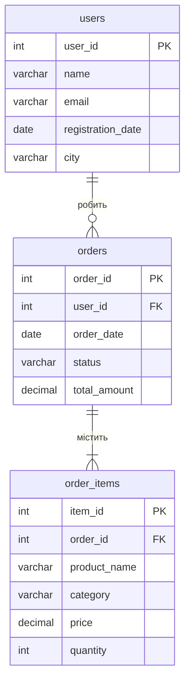

## Схема бази даних

```mermaid
erDiagram
    users ||--o{ orders : "робить"
    orders ||--|{ order_items : "містить"

    users {
        int user_id PK
        varchar name
        varchar email
        date registration_date
        varchar city
    }
    orders {
        int order_id PK
        int user_id FK
        date order_date
        varchar status
        decimal total_amount
    }
    order_items {
        int item_id PK
        int order_id FK
        varchar product_name
        varchar category
        decimal price
        int quantity
    }
```
